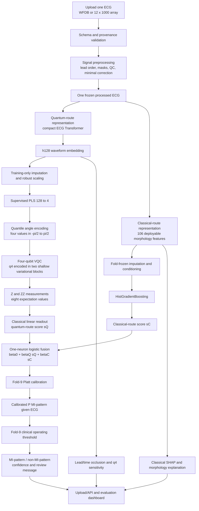
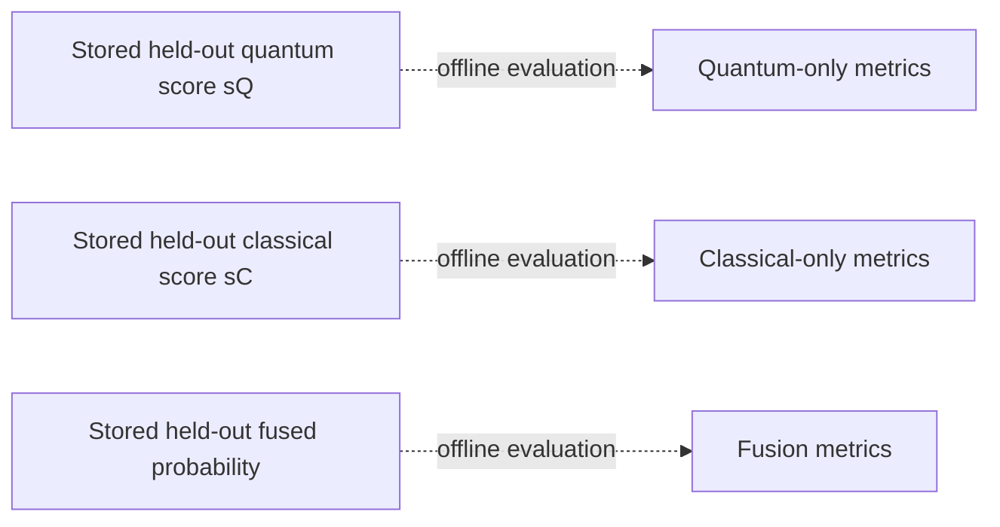

# SIH 26139 requirement audit and final dual-route architecture

**Audit date:** 2026-09-27  
**Source:** `SIH26139.pdf`  
**Verdict:** **PARTIALLY SATISFIED - complete the product and confirmatory layers before calling the solution final.**

## 1. Requirement-by-requirement audit

| SIH requirement | Evidence in the current project | Status |
|---|---|---|
| Biomedical data ingestion | PTB-XL v1.0.3 WFDB records, immutable manifest, patient IDs and provenance | Satisfied |
| Cleaning and noisy/missing-data handling | Structural validation, masks, QC, filtering safeguards, quarantine and morphology validation | Satisfied |
| Normalization, feature engineering, selection and reduction | Fold-local normalization, 106-feature allowlist, statistical feature evidence, Transformer `h128`, supervised PLS `q4` | Satisfied |
| Hybrid quantum-classical architecture | Classical preprocessing and two fixed parallel predictors followed by classical score fusion | Satisfied |
| QPU/simulator and data encoding | Four angle-encoded qubits, repeated data upload, trainable rotations, ring ZZ interactions and exact statevector simulation | Satisfied on simulator |
| QML core predictive model | The VQC produces `sQ` for every eligible input and is always used by the final fusion | Satisfied as a hybrid co-predictor |
| Training and inference workflows | Leakage-safe OOF training and experimental inference exist | Partial: no packaged final inference service or frozen fold-9/10 model |
| Disease probability output | Cross-fitted `P(MI-pattern | ECG)` is produced | Partial: final calibration and threshold remain unfitted |
| Sensitivity/specificity threshold tuning | Development operating-point analysis exists | Partial: fold-9 selection is still pending |
| Explainability | Classical feature SHAP audit and clinically named morphology features exist | Partial: patient-level waveform and quantum-route explanations are incomplete |
| Evaluation against classical baselines | Logistic, SVC, MLP, HGB, tree and matched-q4 controls were evaluated | Satisfied for development benchmarking |
| Improve over classical baselines | Fusion beats the 106-feature HGB alone but loses to the strongest matched all-classical fusion | **Not satisfied** |
| Generalization | Patient-separated official folds 1-8 and patient-cluster bootstrap | Partial: folds 9/10 and an external cohort remain unevaluated |
| Computational efficiency | Four-qubit shallow circuit and simulator timings can be measured | Partial: frozen latency, shot count, QPU cost and energy comparison are absent |
| Near-term hardware compatibility | Four-qubit circuit is small enough in principle | Partial: no finite-shot, noise, transpilation or real-QPU evidence |
| Software platform/prototype | Research CLIs and Kaggle workflows exist | **Not satisfied:** no upload UI/API, end-to-end prediction service or evaluation dashboard |
| Comprehensive documentation | Plans, data contracts, reports, configs and test evidence are versioned | Satisfied |
| Early disease detection | Current label is contemporaneous MI-pattern versus non-MI-pattern | **Not established:** it is not prospective early-risk prediction or acute-MI adjudication |

The system is therefore a strong research prototype, but not yet the fully
functional platform described in the expected solution.

## 2. Final fixed architecture

Every accepted ECG runs through both branches. There is no predictor-selection
mechanism, residual target or dynamic feature routing.

The production path has one result: the calibrated fused probability. The
quantum-only and classical-only scores are retained as offline evaluation
taps for ablation and auditing; they are not alternative patient-facing
predictions and do not select a route.

## 3. How one ECG moves through the system

1. **Ingest and validate.** The platform accepts a ten-second 12-lead ECG,
   verifies its shape, lead order, sampling rate and finite-sample masks, and
   records provenance.
2. **Create one reproducible signal.** Minimal preprocessing removes avoidable
   technical variation without changing diagnostically important morphology.
3. **Run both representations.** The processed waveform is sent simultaneously
   to the learned waveform route and the deployable morphology extractor.
4. **Run the quantum route.** A compact Transformer produces `h128`; fold-frozen
   PLS compresses it to four angle values; the four-qubit VQC encodes, entangles
   and measures them to produce `sQ`.
5. **Run the classical route.** Locally calculated rhythm, QRS, amplitude,
   ST/T and spatial features enter HGB and produce `sC`.
6. **Fuse scores.** A leakage-safe one-neuron logistic model combines `sQ` and
   `sC`. It combines scores, not model parameters.
7. **Calibrate and decide.** Fold 9 must supply the final probability calibrator
   and operating threshold. Fold 10 then provides a one-time unbiased result.
8. **Explain and display.** The interface reports the fused MI-pattern
   probability, thresholded decision, morphology SHAP, waveform lead/time
   occlusion and the applicable confidence message. Standalone branch scores
   remain in the research/evaluation view.

### Clarification on repeated q4 encoding

The retained VQC encodes the same four PLS angles twice, once before each of
two shallow trainable/ZZ blocks. In quantum-circuit terminology this is data
re-uploading. It remains in the frozen circuit because the reported retained
VQC and fusion scores were generated by this exact implementation.

This must not be confused with the unsuccessful expansion experiments:

- structured waveform-plus-clinical re-uploading did not pass its
  prespecified information threshold, so its quantum stage was not promoted;
- wider q8/q12/q16 circuits and full-128 repeated upload did not improve the
  retained result;
- additional depth and denser connectivity did not help.

The project has not established that the second q4 encoding itself is
necessary. Removing it would define a new one-upload circuit and would require
a matched ablation; current two-block metrics cannot be assigned to that
simpler circuit. Therefore it is a frozen implementation choice, not a claimed
source of quantum advantage.

## 4. What is already supported by evidence

On 17,348 development ECGs from 14,958 patients in PTB-XL folds 1-8:

| Output | AUPRC | AUROC | Brier | Sensitivity at about 90% specificity |
|---|---:|---:|---:|---:|
| Quantum route only | 0.82980 | 0.92202 | 0.09247 | 0.76763 |
| Classical morphology route only | 0.71454 | 0.87097 | 0.11884 | 0.61424 |
| Fixed dual-route fusion | **0.83600** | **0.92659** | **0.08961** | **0.77793** |

Fusion minus quantum-only AUPRC was `+0.00624`, with paired patient-cluster
95% interval `[+0.00259, +0.01003]`. This supports using the two fixed routes
together on development data.

It does not establish quantum advantage. The five-seed quantum fusion AUPRC
was `0.83607`, while its matched all-classical fusion reached `0.83766`. The
scientifically accurate claim is that the quantum-containing dual-route system
works and improves over either of its two specified standalone branches, while
a uniquely quantum performance benefit remains unproven.

## 5. Required completion order

1. Freeze and register exact preprocessing hashes, model weights, ensemble
   definition, fusion formula and expected input/output schema.
2. Replace the blocked legacy holdout script with a one-model evaluator for
   this exact dual-route architecture.
3. Use fold 9 once to fit Platt calibration and the sensitivity/specificity
   operating threshold.
4. Use fold 10 once to compare quantum-only, classical-only, fused and matched
   all-classical control outputs.
5. Add finite-shot, device-noise, transpilation-depth, two-qubit-gate and
   latency/cost evaluation; run a prespecified subset on a real QPU if access
   permits.
6. Add patient-level waveform occlusion and q4-coordinate sensitivity beside
   the existing classical SHAP explanation.
7. Build the upload/API/dashboard prototype around frozen artifacts. The UI
   must display `MI-pattern probability`, not acute-MI probability or future
   cardiovascular risk.
8. Validate on an external ECG cohort before making a generalization claim.

## 6. Allowed presentation claim

> AQUIRE-Med is a fixed parallel hybrid system in which every ECG is represented
> through both a four-qubit VQC route and a separate clinical-morphology route.
> Their independently generated scores are fused into an MI-pattern probability.
> Development results favor fusion over either specified standalone branch;
> sealed-test, hardware and platform validation remain in progress.
