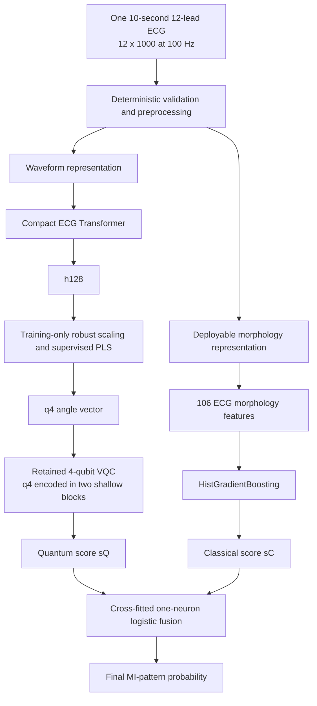

# Fixed parallel classical–quantum dual-route architecture

**Protocol date:** 2026-09-27  
**Status:** development comparison completed; confirmatory folds remain sealed  
**Configuration:** `configs/final_dual_route_v1.json`

## 1. Fixed inference contract

Every structurally valid ECG runs through both predictive branches. There is
no per-patient predictor selection, uncertainty-based branch switching,
residual target, or dynamic feature routing.

Only the fused probability is the production output. The fair overall
classical comparator preserves both representations and replaces only the VQC
with a classical MLP on the identical q4 coordinates:

\[
\text{overall classical}
=\operatorname{Fusion}(\operatorname{HGB}(X_{106}),
\operatorname{MLP}(q_4)).
\]

Stored scores are evaluated offline to produce the required quantum-only,
overall-classical and quantum-plus-classical comparisons. HGB alone remains a
branch-removal diagnostic, not the definition of the overall classical model.

The routes use different representations of the same ECG:

- the quantum route receives four coordinates derived from a learned waveform
  representation;
- the classical route receives 106 locally reproducible rhythm, amplitude,
  QRS, ST/T and spatial morphology measurements.

The branches do not exchange prediction scores before fusion. Knowledge
distillation used during VQC training is declared separately: the clinical
model supplies soft training targets but is not an input to VQC inference.

## 2. Fusion model

Only held-out branch scores meet:

\[
s_F=\beta_0+\beta_Cs_C+\beta_Qs_Q,
\qquad
P(\mathrm{MI\mbox{-}pattern})=\sigma(s_F).
\]

The fusion is a one-neuron logistic model with nonnegative branch
coefficients. During development it is trained by meta-fold cross-fitting, so
the score for a patient is produced by a fusion model that did not train on
that patient's outer-fold score. Final calibration and the operating threshold
must be fitted once on fold 9 after the architecture is registered.

## 3. Required three-way comparison

The exact comparison has already been executed on 17,348 ECGs from 14,958
patients in official PTB-XL folds 1–8. Folds 9 and 10 were not accessed.

### Stabilized retained-VQC experiment

| Required output | Predictor | Development OOF AUPRC | AUROC | Brier |
|---|---|---:|---:|---:|
| Quantum only | Transformer/PLS q4 to train-CDF VQC | **0.82980** | 0.92202 | 0.09247 |
| **Overall classical** | Clinical HGB + identical-q4 MLP fusion | **0.83653** | **0.92736** | **0.08940** |
| Quantum + classical | Clinical HGB + VQC fusion | 0.83600 | 0.92659 | 0.08961 |

Additional branch ablation: the 106-feature morphology HGB alone reached
0.71454 AUPRC. It is not the overall classical system.

These are two-seed, three-restart ensemble results from the frozen stabilized
screen. The corresponding raw five-seed confirmation produced AUPRC 0.82750
for quantum only, 0.83766 for overall classical and 0.83607 for the hybrid
fusion.

The hybrid fusion improves over each of its individual constituent branches,
but it does not beat the fair overall-classical replacement. The matched
clinical-plus-q4-MLP fusion reached 0.83766 in the five-seed experiment, and
the frozen all-classical ceiling is 0.83802. These are scientific controls,
not alternative runtime routes inside the deployed hybrid architecture.

### Paired comparison on the stabilized outputs

| Comparison | Delta AUPRC | Patient-cluster bootstrap 95% interval |
|---|---:|---:|
| Hybrid fusion minus quantum only | +0.00624 | [+0.00259, +0.01003] |
| Hybrid fusion minus overall classical | -0.00052 | [-0.00185, +0.00077] |
| Hybrid fusion minus morphology HGB only | +0.12138 | [+0.11154, +0.13144] |

The intervals use 2,000 paired resamples of the 14,958 patients. At an
approximately 90% specificity operating point, sensitivity was 0.76763 for
quantum only, 0.77656 for overall classical and 0.77793 for hybrid fusion.
Morphology HGB alone reached 0.61424. These are development-fold findings and
require confirmation on the sealed folds.

## 4. Completed work and remaining execution

- [x] Produce patient-isolated OOF quantum-only predictions.
- [x] Produce patient-isolated matched overall-classical predictions by
  replacing VQC with an identical-q4 MLP and preserving clinical fusion.
- [x] Train the leakage-safe score-level fusion.
- [x] Export all three outputs and compute AUPRC, AUROC, Brier and log loss.
- [x] Repeat the experiment across five prespecified seeds.
- [x] Verify folds 9 and 10 remained sealed.
- [ ] Register the frozen ensemble definition, preprocessing hashes and fusion
  formula before confirmatory evaluation.
- [ ] Fit calibration and the operating threshold once on fold 9.
- [ ] Evaluate quantum-only, overall-classical and hybrid-fused outputs once on
  fold 10.
- [ ] Report paired patient-cluster confidence intervals and subgroup results
  for all three outputs.

No new development rerun is justified: it would duplicate completed evidence
and further adapt the design to folds 1–8. The next legitimate compute step is
the preregistered fold-9/fold-10 confirmation.

## 5. Evidence locations

- Stabilized two-seed result: `docs/q4_score_alignment_result_2026-09-25.md`
- Five-seed result: `docs/nested_q4_optimization_result_2026-09-25.md`
- Stabilized OOF artifacts:
  `kaggle_outputs/q4_score_alignment_20260925/q4-score-alignment-screen-v1/`
- Five-seed OOF artifacts:
  `kaggle_outputs/nested_q4_seeds_a_20260925/` and
  `kaggle_outputs/nested_q4_seeds_b_20260925/`
