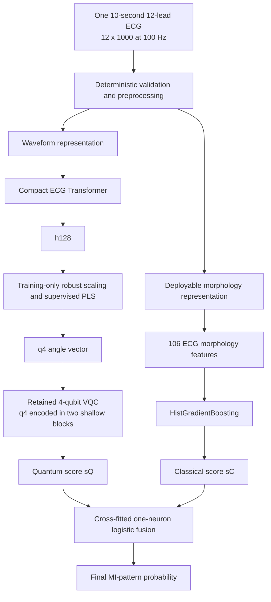

# Fixed parallel classical–quantum dual-route architecture

**Protocol date:** 2026-09-27  
**Status:** development comparison completed; confirmatory folds remain sealed  
**Configuration:** `configs/final_dual_route_v1.json`

## 1. Fixed inference contract

Every structurally valid ECG runs through both predictive branches. There is
no per-patient predictor selection, uncertainty-based branch switching,
residual target, or dynamic feature routing.

Only the fused probability is the production output. Stored `sQ`, stored `sC`
and the fused probability are evaluated separately offline to produce the
required quantum-only, classical-only and fusion ablations.

The routes use different representations of the same ECG:

- the quantum route receives four coordinates derived from a learned waveform
  representation;
- the classical route receives 106 locally reproducible rhythm, amplitude,
  QRS, ST/T and spatial morphology measurements.

The branches do not exchange prediction scores before fusion. Knowledge
distillation used during VQC training is declared separately: the clinical
model supplies soft training targets but is not an input to VQC inference.

## 2. Fusion model

Only held-out branch scores meet:

\[
s_F=\beta_0+\beta_Cs_C+\beta_Qs_Q,
\qquad
P(\mathrm{MI\mbox{-}pattern})=\sigma(s_F).
\]

The fusion is a one-neuron logistic model with nonnegative branch
coefficients. During development it is trained by meta-fold cross-fitting, so
the score for a patient is produced by a fusion model that did not train on
that patient's outer-fold score. Final calibration and the operating threshold
must be fitted once on fold 9 after the architecture is registered.

## 3. Required three-way comparison

The exact comparison has already been executed on 17,348 ECGs from 14,958
patients in official PTB-XL folds 1–8. Folds 9 and 10 were not accessed.

### Stabilized retained-VQC experiment

| Required output | Predictor | Development OOF AUPRC | AUROC | Brier |
|---|---|---:|---:|---:|
| Quantum only | Transformer/PLS q4 to train-CDF VQC | **0.82980** | 0.92202 | 0.09247 |
| Classical only | 106-feature clinical HGB | 0.71454 | 0.87097 | 0.11884 |
| Quantum + classical | Cross-fitted `sQ + sC` fusion | **0.83600** | **0.92659** | **0.08961** |

These are two-seed, three-restart ensemble results from the frozen stabilized
screen. The corresponding raw five-seed confirmation produced AUPRC 0.82750,
0.71786 and 0.83607, respectively.

The fusion improves over either required standalone branch. It does not prove
quantum advantage: a matched clinical-plus-q4-MLP fusion reached 0.83766 in
the five-seed experiment, and the frozen all-classical ceiling is 0.83802.
Those models remain scientific controls and are not alternative runtime routes
inside this architecture.

### Paired comparison on the stabilized outputs

| Comparison | Delta AUPRC | Patient-cluster bootstrap 95% interval |
|---|---:|---:|
| Fusion minus quantum only | +0.00624 | [+0.00259, +0.01003] |
| Fusion minus classical only | +0.12138 | [+0.11154, +0.13144] |
| Quantum only minus classical only | +0.11514 | [+0.10266, +0.12756] |

The intervals use 2,000 paired resamples of the 14,958 patients. At an
approximately 90% specificity operating point, sensitivity was 0.76763 for
quantum only, 0.61424 for classical only and 0.77793 for fusion. These are
development-fold findings and require confirmation on the sealed folds.

## 4. Completed work and remaining execution

- [x] Produce patient-isolated OOF quantum-only predictions.
- [x] Produce patient-isolated OOF classical-only predictions.
- [x] Train the leakage-safe score-level fusion.
- [x] Export all three outputs and compute AUPRC, AUROC, Brier and log loss.
- [x] Repeat the experiment across five prespecified seeds.
- [x] Verify folds 9 and 10 remained sealed.
- [ ] Register the frozen ensemble definition, preprocessing hashes and fusion
  formula before confirmatory evaluation.
- [ ] Fit calibration and the operating threshold once on fold 9.
- [ ] Evaluate quantum-only, classical-only and fused outputs once on fold 10.
- [ ] Report paired patient-cluster confidence intervals and subgroup results
  for all three outputs.

No new development rerun is justified: it would duplicate completed evidence
and further adapt the design to folds 1–8. The next legitimate compute step is
the preregistered fold-9/fold-10 confirmation.

## 5. Evidence locations

- Stabilized two-seed result: `docs/q4_score_alignment_result_2026-09-25.md`
- Five-seed result: `docs/nested_q4_optimization_result_2026-09-25.md`
- Stabilized OOF artifacts:
  `kaggle_outputs/q4_score_alignment_20260925/q4-score-alignment-screen-v1/`
- Five-seed OOF artifacts:
  `kaggle_outputs/nested_q4_seeds_a_20260925/` and
  `kaggle_outputs/nested_q4_seeds_b_20260925/`
