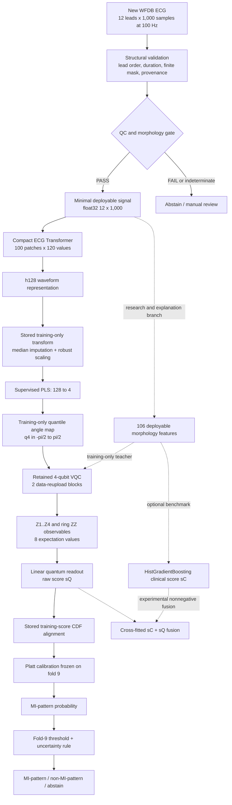

# Final retained VQC architecture and publication-readiness audit

> **Architecture update (2026-09-27):** the user-selected system architecture
> is now the fixed parallel VQC-plus-clinical fusion described in
> [`final_parallel_dual_route_plan_2026-09-27.md`](final_parallel_dual_route_plan_2026-09-27.md).
> The VQC and publication findings below remain valid, but the clinical fusion
> is no longer optional in the final system. Both branches run for every
> eligible input; there is no predictor-selection mechanism.

**Decision:** retain the four-qubit VQC as the project's quantum champion.
**Publication verdict:** MODIFY, then submit as a rigorous benchmark/negative-
result paper. Do not present it as a quantum-advantage or early-clinical-
detection paper.

## 1. Exact scientific task

The task is binary **MI-pattern versus non-MI-pattern classification** of one
10-second, 12-lead ECG. The label is derived from the PTB-XL MI diagnostic
superclass. It is not a prospective cardiovascular-event target, an acute-MI
adjudication based on troponin/angiography, or proof of disease before clinical
onset. The output must therefore be named `P(MI-pattern | ECG)`, not an early
MI risk score.

PTB-XL v1.0.3 contains 21,799 ECGs from 18,869 patients and recommends folds
1–8 for training, fold 9 for validation and fold 10 for testing. The current
development evidence covers 17,348 PRIMARY records from 14,958 patients in
folds 1–8. Folds 9 and 10 remain unopened.

## 2. Final architecture

The solid route is the defensible quantum-core prototype. The feature branch
is used to create leakage-safe soft targets during training and to provide
clinical explanations. The `sC+sQ` fusion remains an experimental benchmark:
it improves over VQC alone but has not beaten the frozen all-classical system,
so it is not evidence that the quantum component adds system value.

## 3. Frozen component specification

### 3.1 Input and signal handling

- canonical input: `float32[12,1000]`, 10 seconds at 100 Hz;
- preserve sample and lead validity masks before replacing missing values;
- disable 50/60 Hz notch claims on the 100 Hz route;
- corrected signals are accepted only after multilead morphology validation;
- structural or QC failure leads to abstention, not an ordinary prediction.

### 3.2 Compact waveform encoder

- 100 non-overlapping 100 ms patches;
- model width 96, four attention heads, three pre-norm encoder blocks;
- feed-forward width 192;
- mean-plus-max pooling followed by a 128-dimensional representation;
- 271,041 trainable encoder parameters;
- trained within each outer patient split; the MI classification head is
  removed before the quantum head receives `h128`.

The encoder is supervised by the MI task. Consequently, the classical front
end already performs substantial predictive representation learning. Calling
the VQC the operational final classifier is accurate; claiming the quantum
circuit discovered the ECG representation is not.

### 3.3 Fold-local q4 construction

For every training partition only:

1. median-impute `h128`;
2. robust-scale using the 25th and 75th percentiles;
3. fit four-component PLS to the MI label;
4. orient each coordinate to have nonnegative training-label correlation;
5. quantile-map the four training coordinates to `[-pi/2, pi/2]`;
6. apply the frozen transforms to validation/test/new ECGs.

PLS is supervised. It is therefore part of the predictive pipeline and must
be included in every classical control. A comparison against a classical
model using a different representation cannot establish quantum value.

### 3.4 Retained VQC

- four qubits initialized in `|0000>`;
- two data-reuploading blocks;
- per wire and block: data-dependent `RY(s_j q_j)` followed by trainable
  `RZ-RY-RZ` rotations;
- trainable Ising-ZZ ring interactions `(0,1), (1,2), (2,3), (3,0)`;
- four local-Z and four ring-ZZ expectation values;
- one linear readout producing `sQ`;
- 45 trainable parameters in total;
- exact PyTorch statevector simulation for current development experiments.

The retained `narrow_js` training recipe uses AdamW, learning rate `5e-3`,
weight decay `1e-4`, a cosine schedule, 60 epochs, a patient-unique balanced
sample of up to 2,000 ECGs per class, and loss

`0.65 * BCE(y, sQ) + 0.35 * JS(p_teacher, sQ)`.

The teacher is an inner-OOF, calibrated HistGradientBoosting model trained on
the 106 deployable features. It is unavailable to the VQC as an inference
input. This must be described as knowledge distillation, not as a purely
quantum predictor trained only from hard labels.

### 3.5 Score alignment, calibration and inference

Each fitted circuit stores its outer-training logit distribution. A new logit
is converted to an empirical training-CDF score without inspecting future
batches. A Platt calibrator and clinical operating threshold must be fitted
once on fold 9 after the entire upstream pipeline is frozen. Fold 10 provides
the one-time final estimate.

The strongest reported score uses restart/seed averaging. If the deployed
prototype executes several circuit instances and averages them, describe it
as a VQC ensemble. If only one circuit is executed, its performance must be
measured separately; ensemble metrics cannot be attached to a single circuit.

## 4. What the existing evidence proves

### Supported

- The compact Transformer recipe substantially improved the representation
  over the earlier ResNet recipe: development OOF AUPRC `0.8325` versus
  `0.7878`, paired delta about `+0.0445 [0.0349, 0.0549]`.
- Four qubits were the best tested VQC width. q8, q12 and q16 were below q4 by
  `-0.0615`, `-0.0208` and `-0.0342` AUPRC, with entirely negative intervals.
- Under the two-seed, three-restart aligned protocol, train-CDF VQC reached
  AUPRC `0.82980` and beat the strongest tested identical-q4 classical head by
  `+0.00307 [0.00107, 0.00506]`.
- The full quantum fusion did not beat the classical fusion: delta `-0.00052
  [-0.00185, 0.00077]`. A separate five-seed experiment also placed quantum
  fusion below classical fusion by `-0.00158 [-0.00277, -0.00042]`.
- Entanglement value is unproven: aligned VQC minus no-entanglement was only
  `+0.00048 [-0.00075, 0.00178]`.
- Adaptive observables, wider circuits, diffusion representations, structured
  re-uploading, multiple distillation schemes, frequency scaling and tied
  equilibrium recurrence did not pass their frozen promotion gates.

### Unsupported

- quantum computational advantage or speedup;
- a clinically meaningful quantum accuracy advantage;
- superiority to the strongest full classical ECG system;
- benefit caused specifically by entanglement;
- performance on noisy or real quantum hardware;
- prospective early MI detection, acute MI diagnosis, prognosis or treatment
  benefit;
- external transportability beyond PTB-XL.

## 5. Novelty audit

| Dimension | Rating | Evidence-based assessment |
|---|---:|---|
| New quantum algorithm | 1/5 | Data re-uploading VQCs, classical encoders, PLS/PCA compression, distillation and classical calibration are established methods. |
| New hybrid architecture | 2/5 | The exact assembly is project-specific, but classical ECG encoder to compressed VQC already exists in current PTB-XL literature. |
| ECG/QML empirical scale | 4/5 | 17,348 OOF ECGs and 14,958 patients are much stronger than the small/subsampled medical-QML studies commonly reported. |
| Benchmarking rigour | 4/5 | Official patient folds, leakage guards, matched-q4 controls, patient bootstrap, negative ablations and sealed folds are substantial strengths. |
| Clinical novelty | 2/5 | MI-superclass recognition on PTB-XL is established and is not an early-event outcome. The hard-negative analysis adds relevance but no external clinical endpoint. |
| Translational readiness | 1/5 | No fold-10 result, external cohort, real-QPU evaluation, prospective study or clinician evaluation exists yet. |

The work therefore has **methodological and empirical novelty**, not strong
algorithmic novelty. That distinction should determine the title, venue and
claims.

## 6. Closest literature and differentiation

1. Ozpolat and Karabatak applied PCA plus simulated QSVM to ECG arrhythmia and
   reported classical SVM accuracy `86.96%` versus QSVM `84.64%`. Our work is
   larger, MI-specific and considerably more rigorous about patient folds,
   calibration and matched controls.
2. *From Foundation ECG Models to NISQ Learners* already combines a classical
   ECG encoder with a six-qubit simulated VQC on PTB-XL. This removes any claim
   that “ECG encoder + VQC” is itself novel. Our differentiation is the full
   12-lead MI-pattern task, official patient-fold protocol, matched-q4
   controls, uncertainty, qubit-scaling and failure analysis.
3. Bowles, Ahmed and Schuld show that ordinary classical models often beat
   QML benchmarks and that removing entanglement may not hurt. Our own
   classical-system and entanglement results agree with that caution.
4. Current medical-QML hardware papers include device-aware circuits and error
   mitigation on real IBM hardware. Our simulator-only study cannot claim the
   same hardware readiness.
5. Current MI-AI literature warns that small, single-source, non-patient-safe
   validation can produce optimistic results. Our patient-safe protocol is a
   publishable strength, but the single-source limitation remains.

## 7. Publication verdict

### Can we submit a paper?

Yes. A transparent preprint or QML/biomedical-AI workshop paper is feasible
now. A credible full journal paper requires the confirmatory work below. A
high-impact clinical or top quantum-methods paper is not supported in the
current state.

### Defensible paper thesis

> A leakage-controlled, patient-level evaluation of a compact four-qubit VQC
> for MI-pattern recognition shows a small same-representation predictive
> signal under one stabilized protocol, but no robust entanglement or
> system-level advantage over strong classical controls; extensive negative
> ablations identify representation compression, seed stability and branch
> redundancy as practical limits.

This is stronger science than claiming that the VQC “beats classical ML.”

Suggested title:

> **Can a Four-Qubit Variational Classifier Add Value to ECG-Based Myocardial-
> Infarction Pattern Detection? A Leakage-Controlled PTB-XL Benchmark**

## 8. Required work before a full-paper submission

1. **Freeze and register the confirmatory protocol.** Publish the code hash,
   primary metric, exact ensemble, controls and stopping rule before opening
   fold 9. Disclose that many development variants were explored on folds
   1–8; ordinary within-experiment intervals do not correct this multiplicity.
2. **Use fold 9 once for calibration and threshold selection.** Make no
   architecture or representation changes afterward.
3. **Open fold 10 exactly once.** Report VQC, no-entanglement, identical-q4
   logistic/MLP, Transformer head and strongest classical system with paired
   patient-bootstrap intervals.
4. **Resolve the ensemble definition.** Freeze either one circuit or the exact
   seed/restart ensemble and report the cost of every executed circuit.
5. **Add shot/noise evidence.** Evaluate finite-shot degradation, calibrated
   device noise, transpiled depth, two-qubit gate count and mitigation. Run a
   prespecified representative subset on actual four-qubit hardware if access
   permits. This demonstrates feasibility, not quantum advantage.
6. **Add transport evidence.** Harmonize an external ECG cohort with an MI
   endpoint and perform a locked external test. A historical PTB cohort is a
   useful domain-shift check but does not establish acute clinical utility.
7. **Add clinically grounded explanations.** Use lead/time occlusion and
   counterfactual or attribution stability; test concordance with Q/QS, ST/T
   and reciprocal territories. Avoid treating PLS coordinates or circuit
   parameters as direct clinical explanations.
8. **Report subgroup and utility analyses.** Age, sex, label-quality, QC and
   hard-negative strata; calibration slope/intercept; decision curves; false-
   positive review; abstention coverage and latency/cost.
9. **Follow TRIPOD+AI and assess PROBAST+AI.** Release the preprocessing,
   manifest, model configurations, environment lock, OOF predictions and
   analysis scripts needed to reproduce every table.

## 9. Recommended manuscript structure

1. Clinical task and claim boundary.
2. Dataset version, label construction and patient-safe cohort.
3. Frozen preprocessing and Transformer representation.
4. Fold-local PLS-q4 and retained VQC.
5. Matched classical, no-entanglement and circuit-removal controls.
6. Prespecified metrics, calibration and patient-cluster uncertainty.
7. Main confirmatory fold-10 result.
8. Qubit-width, representation, distillation and measurement ablations.
9. Hardware/noise resource analysis.
10. Failure analysis, multiplicity, clinical limitations and reproducibility.

The negative experiments belong in the main evidence, not a hidden appendix:
they are a major part of the paper's actual contribution.

## References used for the audit

- PTB-XL v1.0.3: <https://physionet.org/content/ptb-xl/1.0.3/>
- PTB-XL benchmark: <https://arxiv.org/abs/2004.13701>
- ECG QSVM comparison: <https://pubmed.ncbi.nlm.nih.gov/36980406/>
- ECG encoder-to-VQC competitor: <https://arxiv.org/abs/2603.27269>
- QML benchmarking principles: <https://arxiv.org/abs/2403.07059>
- Real-hardware medical-QML benchmark:
  <https://www.nature.com/articles/s41598-026-35605-3>
- MI-AI validation review: <https://pubmed.ncbi.nlm.nih.gov/41095870/>
- TRIPOD+AI: <https://www.bmj.com/content/385/bmj-2023-078378>
- PROBAST+AI: <https://www.bmj.com/content/388/bmj-2024-082505>
