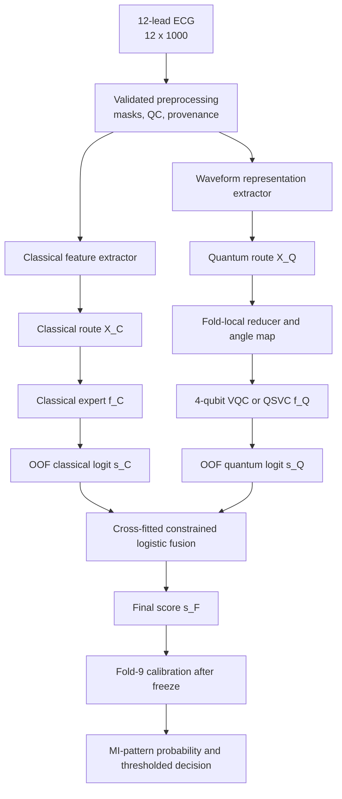

# Independent classical–quantum feature routing and fusion plan

**Protocol date:** 2026-09-24  
**Status:** frozen implementation plan; no result has been produced by this protocol  
**Decision:** PROCEED as a new experiment, while preserving the residual-routing study as a negative ablation

## 1. Question this experiment answers

Can two independently trained predictors add complementary information when:

1. the classical predictor receives a prespecified set of stable, locally
   reproducible ECG features;
2. the quantum predictor receives a different, prespecified representation;
3. both predictors learn the MI/non-MI label directly; and
4. a small leakage-safe fusion model combines only their held-out scores?

This is **not** residual learning. The following operations are forbidden in
this experiment:

- computing `r = y - p_classical` as a target;
- weighting quantum samples according to classical errors;
- giving the classical score, error or confidence to the quantum model;
- dynamically sending a patient to one route according to classical
  uncertainty;
- choosing individual feature routes from pooled outer-fold performance;
- changing the route after looking at Fold 9 or Fold 10.

Both branches solve the same direct task:

\[
s_C=f_C(X_C;\theta_C),\qquad
s_Q=f_Q(X_Q;\theta_Q),\qquad
y\in\{0,1\}.
\]

Only their out-of-fold logits meet:

\[
s_F=\beta_0+\beta_Cs_C+\beta_Qs_Q,
\qquad P(\mathrm{MI})=\sigma(s_F).
\]

The branch parameters remain separate. We learn
`theta_C`, `theta_Q`, and `theta_F`; we do not concatenate or average the
parameters themselves.

## 2. Scientific correction: periodicity is not a routing rule

An ECG is quasi-periodic, but a VQC does not receive the original time axis in
this study. It receives four or six numerical coordinates. A quantum model is
not inherently suited to “non-periodic” features, nor inherently unsuitable
for periodic signals. In parameterized quantum models, the accessible
frequencies are determined by the data-encoding gates and the number of
re-uploading layers; that mathematical frequency spectrum is not the same as
the clinical periodicity of an ECG.

Accordingly, a feature is considered for the quantum route because it forms a
compact, interaction-rich representation with healthy quantum geometry, not
because it lacks periodicity. Every such hypothesis must beat strong
identical-input classical controls.

## 3. Existing evidence that constrains the design

All existing results use PTB-XL development folds 1–8; Fold 9 and Fold 10 have
not been used for the decisions below.

| Existing experiment | Patient-pooled OOF AUPRC | Consequence |
|---|---:|---|
| Transformer head | 0.832500 | strongest single waveform model tested |
| h128 logistic | 0.824708 | much of h128 is classically accessible |
| supervised Transformer PLS-q4 logistic | 0.822393 | mandatory q4 control |
| supervised Transformer PLS-q4 VQC | 0.814757 | best VQC so far, but not a quantum win |
| residual-fusion classical expert | 0.837996 | reference performance floor for a useful fusion |
| best primary residual VQC fusion | 0.837933 | residual routing failed |

The former q4 VQC and Transformer scores had Spearman correlation 0.9510.
The residual VQC study then failed against both the classical expert and its
matched MLP. This new study therefore changes the scientific question. It asks
whether **independent feature representations and direct targets** produce
complementarity. It does not retune the failed residual method.

## 4. Task and data contract

- Dataset: verified PTB-XL v1.0.3, 21,799 manifest records.
- Development population: the 17,348 accepted records in official folds 1–8,
  subject to the already frozen QC and structural eligibility rules.
- Unit of splitting and uncertainty: patient, never ECG record.
- Input: one 10-second, 12-lead, 100 Hz ECG in canonical order,
  `float32[12,1000]`, plus masks and provenance.
- Target: MI-superclass pattern versus no MI-superclass pattern, derived
  dynamically from `scp_statements.csv`.
- Hard-negative cohort: abnormal non-MI records carrying prespecified STTC,
  CD or HYP classes.
- Fold 9: sealed until the complete route, models, fusion and thresholds are
  frozen; later used for calibration/validation only.
- Fold 10: sealed until the one-time final evaluation.
- Primary metric: patient-pooled OOF AUPRC.
- Secondary metrics: AUROC, Brier score, log loss, calibration slope and
  intercept, sensitivity at 90% specificity, hard-negative false-positive
  rate, latency and cost.

The output remains an **MI-pattern probability**, not the probability that a
patient is experiencing an acute infarction. ECG alone does not establish an
acute clinical MI without the relevant clinical context and biomarkers.

## 5. Frozen architecture



No edge from `s_C` or a classical error enters the quantum branch.

## 6. Two routing hypotheses to test

The study has one primary routing hypothesis and one mechanistic secondary
hypothesis. Their roles are fixed before execution.

### Route A — representation-disjoint primary experiment

This is the strongest practical design.

#### Classical branch `X_C-A`

Use the signed allowlist in
`configs/approved_feature_manifest_v0_4.json`:

- heart rate and RR statistics;
- per-lead range, validated R/S amplitudes and R/S ratios;
- per-lead ST60 and T polarity;
- inferior, high-lateral, lateral and anterior composites;
- ST reciprocity and regional contrasts;
- global ST/T extent, precordial transition and frontal-axis proxy.

The allowlist currently contains 106 deployable fields. The 20 frozen
exclusions remain unavailable to both routes. Redundancy rules come from
`configs/redundancy_resolution.json` and are applied inside training data.

The primary classical model is HistGradientBoosting because it accepts
nonlinear tabular effects and missingness. Regularized logistic regression and
XGBoost are controls. No PTB-XL+ commercial diagnostic output, report text,
SCP code, infarction stage, patient ID or post-diagnosis field may enter.

#### Quantum branch `X_Q-A`

Use the waveform representation, not the 106 named columns:

\[
x\in\mathbb R^{12\times1000}
\rightarrow h_{128}
\rightarrow \operatorname{PLS}_{y}(h_{128})
\rightarrow q_4
\rightarrow f_Q(q_4).
\]

- `h128` comes from the compact ECG patch Transformer.
- The Transformer classification head is removed from the quantum inference
  path.
- The encoder checkpoint, robust scaling, PLS and angle mapping are all
  fold-specific.
- PLS predicts the MI label directly. It never predicts a classical residual.
- Four coordinates are primary because q4 remains the best tested quantum
  width. q6 is conditional; q8/q12/q16 are not repeated without new evidence.

This route is representation-disjoint: the classical branch receives named
measurements, while the quantum branch receives learned waveform coordinates.
Both originate from the same ECG, so the study will call them different
representations rather than statistically independent sources.

### Route B — clinically disjoint mechanism experiment

This directly tests the proposed idea that different clinical feature families
may favor different learners.

#### Classical QRS/rhythm route `X_C-B`

- heart rate, RR median, RR IQR and RR coefficient of variation;
- per-lead range, R amplitude, S amplitude and R/S ratio;
- regional R-amplitude and R/S composites;
- precordial transition and frontal-axis proxy.

#### Quantum ST/T route `X_Q-B`

- twelve ST60 measurements;
- twelve T-polarity measurements;
- regional ST mean, ST absolute maximum, abnormal-lead count and T-inversion
  fraction;
- inferior/high-lateral reciprocity and anterior/inferior contrast;
- global ST RMS, positive/negative ST counts and global T-inversion count.

The QRS/rhythm branch does not receive ST/T columns, and the ST/T branch does
not receive QRS/rhythm columns. The ST/T matrix is reduced fold-locally to q4
using direct-label PLS. This split is motivated by clinical structure: MI
evidence includes spatially related changes across contiguous leads,
reciprocal changes, Q/QS morphology and associated T-wave changes. It is not
motivated by periodicity.

Route B must be compared with:

1. a classical model on `X_C-B` alone;
2. a quantum model on `X_Q-B` alone;
3. an identical-input classical model on the same q4;
4. the fused `X_C-B + X_Q-B` result;
5. an all-classical two-branch fusion;
6. a single classical oracle using the union of both feature families; and
7. a prespecified route-swap control.

If the union classical model wins, forced routing has not added value.

## 7. Quantum representation and circuit protocol

### 7.1 Fold-local reduction

For each outer training fold:

1. median-impute from training patients only;
2. robust-scale from training patients only;
3. fit four-component PLS to the direct MI label;
4. orient each PLS component deterministically so its training correlation
   with the label is nonnegative;
5. map each component by a training-only empirical quantile transform to
   `[-pi/2, pi/2]`;
6. clip validation values at the frozen training bounds;
7. serialize every fitted transform and its training-patient hash.

The transform must expose `fit`, `transform`, and provenance. No full-cohort
PCA, PLS, scaling, feature ordering or angle range is permitted.

### 7.2 Primary VQC

- 4 qubits, one coordinate per qubit;
- two data-reuploading blocks;
- `RY(q_j)` data encoding per block followed by trainable `RZ-RY-RZ`
  rotations;
- shallow ring entanglement using nearest-neighbor `IsingZZ` or `CZ` gates;
- trainable single-qubit rotations;
- local `Z` and ring-neighbour `ZZ` expectations followed by one linear
  quantum readout;
- analytic statevector and exact expectations through the GPU-capable PyTorch
  simulator for the primary screen;
- binary cross-entropy on the MI label;
- class weighting fixed from outer-training prevalence;
- gradient, loss, observable variance and parameter audit saved each epoch.

Data re-uploading is included because the encoding choice determines the
function spectrum a variational circuit can express. Depth remains shallow to
limit barren-plateau, concentration and hardware-noise risks.

### 7.3 Secondary quantum candidates

- q4 IQP-QSVC on the identical q4 coordinates;
- projected q4 quantum kernel with local observables;
- q6 VQC only when q4 passes representation-health and complementarity gates.

These are model-selection candidates, not extra inputs to the fusion layer.
The winner is selected inside development data under the same folds and sample
budget.

### 7.4 Mandatory identical-input controls

Every quantum result must be paired with models receiving exactly the same q4:

- logistic regression;
- RBF-SVC;
- Laplacian-SVC;
- parameter-count-matched MLP;
- circuit-removal linear readout;
- label-shuffle and coordinate-shuffle controls.

The quantum route is not called useful merely because it beats a weak baseline.

## 8. Classical branch protocol

The classical branch is trained independently against `y`.

1. Enforce the signed feature allowlist.
2. Fit imputation, clipping, transformations, redundancy handling and scaling
   inside the training split only.
3. Tune the model in official-fold inner validation, optimizing AUPRC.
4. Save raw decision logits before probability calibration.
5. Generate one held-out logit for every eligible development record.
6. Verify zero patient overlap and immutable feature order.

Primary model: HistGradientBoosting. Controls: elastic-net logistic regression
and XGBoost. An all-feature classical oracle is required for Route B.

Demographics are not silently added. Age and sex may be evaluated later as an
explicit side-information ablation only when the prototype collects them at
inference. The primary waveform-only claim cannot depend on them.

## 9. Leakage-safe fusion layer

### 9.1 Primary fusion

The primary fusion is one L2-regularized logistic neuron using raw branch
logits:

\[
s_F=\beta_0+\beta_Cs_C+\beta_Qs_Q.
\]

It contains no hidden layer. A neural fusion head is deferred because a larger
head could become the true predictor and obscure branch contribution.

### 9.2 Development cross-fitting

1. Produce patient-safe OOF `s_C` and `s_Q` for official folds 1–8.
2. For meta-fold `k`, train the fusion neuron on base-model OOF logits from the
   other seven folds.
3. Predict fusion logits for meta-fold `k`.
4. Concatenate the eight untouched meta-fold predictions.

Thus every final development prediction is held out from its base models and
from its fusion model. The diagnostic practice of fitting and scoring a stack
on the same pooled OOF table is prohibited.

### 9.3 Fusion constraints

- Standardize logits using meta-training data only.
- Select the L2 strength using only the seven meta-training folds.
- Predeclare two versions: unconstrained logistic and nonnegative
  `beta_C,beta_Q >= 0` logistic.
- The nonnegative version is primary because a stable branch should not be
  promoted by learning a sign reversal.
- Add `s_C*s_Q` only as a conditional ablation after the two-score fusion
  passes; no MLP fusion in the primary screen.
- Save fold-wise coefficients. A quantum coefficient that changes sign or
  collapses toward zero is evidence against useful quantum complementarity.

### 9.4 Final fit and calibration

After the entire architecture is frozen:

1. refit both base branches using folds 1–8;
2. fit the fusion neuron on their folds 1–8 OOF logits;
3. obtain untouched Fold-9 fusion logits;
4. fit the final probability calibrator and clinical threshold on Fold 9;
5. lock all artifacts;
6. evaluate Fold 10 once.

Calibration is applied once to the final fusion score. Neither branch receives
a separate calibration layer before fusion.

## 10. Statistical analysis plan

### 10.1 Branch quality

Report for each fold and pooled patients:

- AUPRC, AUROC, Brier score and log loss;
- sensitivity at 90% specificity;
- hard-negative AUPRC and false-positive rate;
- score distribution, calibration slope and calibration intercept;
- inference latency, circuit evaluations and parameter count.

### 10.2 Complementarity before fusion

Measure on OOF logits:

- Spearman and Pearson score correlation;
- error overlap and double-fault rate at the frozen operating point;
- conditional performance of each branch in deciles of the other branch;
- disagreement table by MI subtype and hard-negative group;
- incremental log-loss deviance from adding `s_Q` to `s_C`;
- fold-wise stability of the quantum coefficient.

These analyses describe complementarity. They do not change the routes.

### 10.3 Paired uncertainty

Use a patient-cluster bootstrap so all ECGs belonging to one patient are
resampled together. Use at least 2,000 replicates for final development
comparisons and report the point estimate, median bootstrap delta and 95%
percentile interval for:

- fusion minus classical branch;
- fusion minus quantum branch;
- fusion minus all-classical oracle;
- quantum branch minus each identical-input classical control;
- full fusion minus quantum-score removal;
- full fusion minus quantum-coordinate shuffle.

Do not infer superiority from overlapping individual confidence intervals;
use the paired metric difference.

### 10.4 Subgroups and failure analysis

Report sex, age band, QC group, hard-negative group, MI subtype, annotation
quality and number of ECGs per patient. These are safety and robustness
analyses, not new route-selection opportunities. Report bootstrap uncertainty
and suppress unstable tiny strata.

Review at least:

- high-confidence false positives;
- high-confidence false negatives;
- cases where quantum correct/classical wrong;
- cases where classical correct/quantum wrong;
- fusion regressions introduced by disagreement;
- signal artifacts, conduction disorders, hypertrophy and ST/T mimics.

## 11. Prespecified success and stop gates

### Gate R0 — data and feature contract

- all inputs resolve to immutable `ecg_id` and patient IDs;
- folds 9/10 access tests pass;
- feature routes are disjoint according to their frozen registry;
- excluded and nondeployable fields cannot enter;
- every transformation records its training-patient hash.

### Gate R1 — representation health

- q coordinates are finite and nonconstant in every fold;
- no single coordinate explains effectively all variance;
- VQC local observables have nontrivial variance;
- quantum kernels are PSD within tolerance and are neither identity-like nor
  constant;
- gradients remain finite and nonzero;
- performance is above label- and coordinate-shuffle controls.

### Gate R2 — direct quantum prediction

The q4 quantum model must train successfully in all eight folds. It must be
compared with every identical-input control. A failure here stops circuit or
qubit expansion.

### Gate R3 — independent fusion value

The primary fusion advances only if all conditions hold:

1. patient-bootstrap `Delta AUPRC = fusion - classical` has a 95% interval
   entirely above zero;
2. point improvement is at least 0.005 AUPRC, or it produces a prespecified
   clinically meaningful operating-point gain without worse Brier score;
3. fusion is not inferior to the all-classical oracle;
4. removing or shuffling `s_Q` causes a reproducible decline;
5. `beta_Q` is positive and directionally stable across at least six of eight
   meta-folds;
6. no single fold or subgroup supplies the gain;
7. the same conclusion survives five prespecified random seeds;
8. the quantum branch is competitive with its same-input MLP and kernel
   controls.

### Gate R4 — claim language

- If fusion passes R3, call it **useful hybrid complementarity**.
- Claim **quantum predictive advantage** only if the quantum route and fusion
  also beat all strong identical-input classical controls with paired positive
  intervals and comparable compute budgets.
- If the fusion contains a quantum branch but removal does not hurt, call it a
  quantum-containing prototype, not a quantum-beneficial model.
- Never force `beta_Q > 0` merely to satisfy the problem statement.

### Gate R5 — sealed validation

Only one frozen route reaches Fold 9. Fold 10 remains inaccessible until the
Fold-9 calibration, threshold, artifact hashes and model card are complete.

## 12. Ablation matrix

| ID | Classical input/model | Quantum input/model | Fusion | Purpose |
|---|---|---|---|---|
| A0 | all 106 / HistGB | none | none | classical reference |
| A1 | none | Transformer PLS-q4 / VQC | none | direct quantum branch |
| A2 | none | same q4 / logistic, MLP, RBF, Laplacian | none | identical-input controls |
| A3 | all 106 / HistGB | Transformer PLS-q4 / VQC | cross-fitted logistic | primary Route A |
| A4 | all 106 / HistGB | Transformer PLS-q4 / matched MLP | same fusion | all-classical matched fusion |
| A5 | all 106 / HistGB | shuffled q4 or shuffled sQ | same fusion | quantum contribution control |
| B0 | QRS/rhythm / HistGB | none | none | classical half of Route B |
| B1 | none | ST/T PLS-q4 / VQC | none | quantum half of Route B |
| B2 | QRS/rhythm / HistGB | ST/T PLS-q4 / VQC | cross-fitted logistic | clinical-family split |
| B3 | union / HistGB | none | none | all-feature classical oracle |
| B4 | ST/T / HistGB | QRS/rhythm PLS-q4 / VQC | cross-fitted logistic | route-swap specificity |
| B5 | QRS/rhythm / HistGB | ST/T PLS-q4 / matched MLP | same fusion | all-classical split control |

The residual-fusion result is reported alongside this matrix as a historical
negative result, not rerun and not mixed into model selection.

## 13. Exact implementation order

### Phase I — contracts and registries

- [ ] Add `configs/independent_route_v1.json` with Route A and Route B feature
  lists, exclusions, source manifest hash, target, fold policy and seeds.
- [ ] Add a validator proving no forbidden column, fold or cross-route feature
  appears.
- [ ] Add a dependency graph for Route B proving which raw measurements create
  every composite and that QRS/rhythm and ST/T sources are separated.
- [ ] Freeze primary and secondary endpoints, promotion gates and branch roles.

### Phase II — reusable transforms

- [ ] Implement `aquire_preprocessing/independent_routing.py` with immutable
  route contracts and `fit/transform` APIs.
- [ ] Implement direct-label fold-local PLS plus deterministic component
  orientation and quantile angle mapping.
- [ ] Store feature order, medians, scales, PLS loadings, angle bounds, hashes
  and software versions.
- [ ] Add tests for NaN handling, column order, unseen values, deterministic
  transforms and zero patient overlap.

### Phase III — branch training

- [ ] Implement the classical Route A and Route B experts using the existing
  approved feature pipeline.
- [ ] Reuse the existing trained q4 VQC implementation only after verifying
  that its target is `y`, not a residual.
- [ ] Add direct q4 QSVC/projected-kernel adapters behind one common interface.
- [ ] Add matched logistic, RBF, Laplacian and parameter-count MLP controls.
- [ ] Save raw logits, not pre-calibrated probabilities, for fusion.

### Phase IV — cross-fitted fusion

- [ ] Implement `aquire_preprocessing/score_fusion.py` with meta-fold
  cross-fitting, nonnegative logistic coefficients and L2 regularization.
- [ ] Assert that a meta-fold's patient IDs never appear in its fusion fit.
- [ ] Add classical-only, quantum-only, quantum-removal, score-shuffle and
  route-swap ablations.
- [ ] Unit-test a synthetic case where complementary branches improve and a
  redundant branch receives a near-zero coefficient.

### Phase V — local preflight

- [ ] Run 128 records through both routes and compare package versus Kaggle
  entrypoints bit-for-bit where deterministic.
- [ ] Run one fold with 100 quantum training patients per class.
- [ ] Verify finite gradients, declining loss, nonconstant observables,
  restartable checkpoints and complete artifact schemas.
- [ ] Estimate runtime and storage before submitting the full job.

### Phase VI — frozen Kaggle development screen

- [ ] Create `run_independent_dual_route_screen.py` as the only experiment
  driver.
- [ ] Create a thin `kaggle_independent_route_runner/` wrapper with no copied
  preprocessing, label or fusion logic.
- [ ] Use GPU for Transformer embedding/training; use the fastest validated
  statevector backend for q4; do not label CPU `lightning.qubit` as QPU/GPU.
- [ ] Save one atomic checkpoint after every fold and candidate.
- [ ] Produce eight-fold OOF logits for A0–A5 and B0–B5.
- [ ] Run cross-fitted fusion and paired patient bootstrap.
- [ ] Download and checksum all artifacts before interpreting the result.

### Phase VII — conditional robustness

Run only when the primary fusion passes R3:

- [ ] five frozen seeds;
- [ ] patient-unique training-size curve;
- [ ] q6 capacity ablation;
- [ ] circuit depth and data-reuploading ablation;
- [ ] 1,024/4,096-shot inference and device-noise simulation;
- [ ] probability and operating-point robustness;
- [ ] latency and INR cloud-cost report.

### Phase VIII — sealed evaluation and prototype

- [ ] Freeze the route and all model hyperparameters.
- [ ] Fit the folds 1–8 production branches and OOF fusion.
- [ ] Open Fold 9 once for final calibration and threshold selection.
- [ ] Write the model card and freeze all hashes.
- [ ] Open Fold 10 once for final evaluation.
- [ ] Package preprocessing, `f_C`, `f_Q`, fusion, calibration, QC and
  abstention into one inference service.
- [ ] Demonstrate branch scores, fused probability and an honest quantum
  removal comparison in the dashboard.

## 14. Required artifact tree

```text
artifacts/independent_dual_route_v1/
  protocol.json
  source_registry.json
  route_registry.json
  fold_boundaries.csv
  branch_oof_predictions.parquet
  fusion_crossfit_predictions.parquet
  fold_metrics.csv
  pooled_metrics.csv
  fusion_coefficients.csv
  complementarity_report.json
  quantum_geometry_report.json
  quantum_training_audit.json
  patient_bootstrap.csv
  subgroup_metrics.csv
  failure_cases.csv
  runtime_cost.csv
  hashes.json
  checkpoints/fold_*/
```

Every prediction row must contain `ecg_id`, patient ID, official fold, label,
hard-negative flag, QC group, `s_C`, `s_Q`, `s_F`, candidate ID and seed.

## 15. Tests required before a full run

- route lists are frozen and mutually exclusive where the protocol requires;
- derived-feature dependency checks prevent hidden cross-route reuse in Route B;
- no fold 9/10 read in development mode;
- no patient overlap across base or fusion fits;
- PLS/scaling/quantile transforms use training rows only;
- a quantum branch cannot access `s_C`, `p_C`, residuals or classical losses;
- fusion receives only held-out raw logits;
- shuffled quantum scores cannot spuriously improve the synthetic test;
- package and Kaggle wrapper outputs match;
- resume produces the same completed predictions as an uninterrupted run;
- metrics are patient-pooled and bootstrap resampling is patient-clustered;
- missing, constant and nonfinite inputs fail safely;
- every model and transform carries an immutable training-patient hash.

## 16. Risks and controls

| Risk | Control |
|---|---|
| Quantum branch repeats classical information | complementarity audit, all-classical fusion and score-shuffle controls |
| Supervised Transformer performs most of the prediction | report Transformer-head and h128-logistic ceilings; remove head from inference; require VQC same-input controls |
| Fusion learns the evaluation fold | meta-fold cross-fitting and patient overlap assertions |
| Outcome-driven routing overfits | freeze feature families before execution; no pooled route reassignment |
| Four coordinates discard useful information | compare representation ceiling and q4 controls; q6 only after a positive q4 gate |
| Larger circuit concentrates or becomes untrainable | shallow local circuit, observable variance, kernel and gradient diagnostics |
| Classical branch dominates fusion | report coefficient stability and quantum-removal delta; do not force a quantum coefficient |
| Composite and direct features secretly overlap | dependency registry and the explicitly separated Route B source families |
| Multiple experiments manufacture a winner | one primary route, one secondary route, fixed gates and complete result table |
| Clinical interpretation overreaches | describe MI-pattern classification; review hard negatives and diagnostic mimics |

## 17. Decision outcomes

### GO

Promote the independent fusion only when Gate R3 and the conditional robustness
stage pass. The defensible claim is that the quantum branch contributes
complementary prediction under this frozen protocol.

### MODIFY

If the quantum branch is useful only in one reproducible subgroup or clinical
operating point, modify the objective prospectively and rerun the complete
nested protocol. Do not select the subgroup retrospectively as the main task.

### AVOID

Stop this strategy when the quantum coefficient is unstable, quantum removal
does not hurt, the fusion fails to exceed the all-classical oracle, or a
matched classical learner on `X_Q` performs as well or better. In that case,
retain the q4 VQC as the required quantum-core demonstrator and report that
predictive quantum benefit was not established.

## 18. Research basis

1. Wagner et al., [PTB-XL, a large publicly available electrocardiography
   dataset](https://www.nature.com/articles/s41597-020-0495-6) — patient-aware
   official folds, signal format, labels and quality metadata.
2. PhysioNet, [PTB-XL+ official documentation](https://physionet.org/content/ptb-xl-plus/1.0.1/)
   — measurement provenance and the distinction between reproducible and
   commercial reference measurements.
3. Thygesen et al., [Fourth Universal Definition of Myocardial
   Infarction](https://www.jacc.org/doi/10.1016/j.jacc.2018.08.1038) —
   contiguous-lead, Q/QS, ST and T-wave relationships motivating clinical
   feature families.
4. Havlíček et al., [Supervised learning with quantum-enhanced feature
   spaces](https://www.nature.com/articles/s41586-019-0980-2) — quantum feature
   maps and variational classification.
5. Pérez-Salinas et al., [Data re-uploading for a universal quantum
   classifier](https://quantum-journal.org/papers/q-2020-02-06-226/) —
   data-reuploading expressivity and the need for classical comparison.
6. Schuld, Sweke and Meyer, [Effect of data encoding on the expressive power
   of variational quantum-machine-learning
   models](https://doi.org/10.1103/PhysRevA.103.032430) — encoding-defined
   frequency spectra; temporal periodicity is not a quantum-routing rule.
7. Huang et al., [Power of data in quantum machine
   learning](https://www.nature.com/articles/s41467-021-22539-9) — strong
   classical controls and geometric tests for claimed quantum separation.
8. Thanasilp et al., [Exponential concentration in quantum kernel
   methods](https://www.nature.com/articles/s41467-024-49287-w) — kernel
   concentration risk and the value of shallow/local projections.
9. Wolpert, [Stacked generalization](https://doi.org/10.1016/S0893-6080(05)80023-1)
   — combining held-out base-model predictions rather than training outputs.
10. Collins et al., [TRIPOD+AI](https://www.bmj.com/content/385/bmj-2023-078378)
    — transparent reporting of clinical prediction-model development and
    evaluation.
11. Parvandeh et al., [Consensus nested cross-validation](https://pmc.ncbi.nlm.nih.gov/articles/PMC7776094/)
    and Edwards et al., [nestedcv](https://pmc.ncbi.nlm.nih.gov/articles/PMC10125905/)
    — leakage-safe feature selection and stability assessment in biomedical
    modeling.

## 19. Final recommendation before coding

Implement Route A first because it preserves the strongest existing quantum
representation while making the classical and quantum predictors independent.
Implement Route B second as the direct test of clinically distinct feature
families. Keep q4 fixed for the first full run, use a one-neuron cross-fitted
fusion layer, and require the quantum-removal and identical-input controls.

This is a valid research experiment, but it is not a promise that quantum will
win. Its value is that a positive or negative conclusion will be attributable
to a frozen independent-routing hypothesis rather than to residual weighting,
feature leakage or an overpowered fusion network.
