# AQUIRE-Med — Complete Pipeline Flow Diagram & Situation Report
**Commit: `8ac91d6` | Branch: `main` | Date: 2026-09-19**

---

## Current Situation

The project is a **clinical ECG myocardial infarction (MI) detector** built on PTB-XL v1.0.3 (21,799 ECGs). It follows a strict "Contract → Gate → Manifest" architecture where every phase must produce a signed artifact before the next phase is allowed to start.

### Status at a glance

| Phase | Status | What it produced |
| :--- | :---: | :--- |
| Raw data ingestion + identity checks | ✅ Done | Dataset contract, fold assignments |
| Signal preprocessing (QC, resampling, morphology) | ✅ Done | `primary_development_100hz.h5` |
| Feature extraction v0.4 | ✅ Done (Kaggle) | `deployable_features_v0_4_development.csv` |
| Feature evidence gate (G5F) | ✅ Done (Kaggle) | `approved_feature_manifest_v0_4.json` (106 features) |
| Pre-modelling conditioning (G5.5) | ✅ Done (local code) | Code in `aquire_preprocessing/` |
| Phase 6A — OOF classical baselines | 🔜 Ready to run | Needs Kaggle push |
| SHAP attribution audit | 🔜 Ready to run | Needs Phase 6A output |
| RAPS conformal prediction sets | 🔜 Ready to run | Needs Phase 6A output |
| Phase 6B — stacking / DL / fusion | ⛔ Not planned yet | — |

### Folds policy
- **Folds 1–8** → development (training + OOF validation)
- **Fold 9** → reserved (never seen during any tuning)
- **Fold 10** → final test set (locked with a hard guard in code)

---

## Full Pipeline Flow Diagram

```mermaid
flowchart TD
    classDef done fill:#1a7f37,color:#fff,stroke:#1a7f37
    classDef ready fill:#0969da,color:#fff,stroke:#0969da
    classDef pending fill:#6e7781,color:#fff,stroke:#6e7781
    classDef gate fill:#9a3412,color:#fff,stroke:#9a3412
    classDef artifact fill:#6f42c1,color:#fff,stroke:#6f42c1
    classDef module fill:#0d1117,color:#e6edf3,stroke:#30363d

    %% ============================================================
    %% LAYER 0 — RAW DATA
    %% ============================================================
    subgraph L0["Layer 0 · Raw Dataset"]
        DS1["PTB-XL v1.0.3\n21,799 ECGs\n12-lead, 500 Hz"]
        DS2["PTB-XL+ v1.0.1\nECGDeli reference\nfeatures"]
    end

    %% ============================================================
    %% LAYER 1 — DATA INGESTION & IDENTITY
    %% ============================================================
    subgraph L1["Layer 1 · Ingestion & Identity  [structural.py · registry.py · manifest.py]"]
        L1A["Row count assert\n= 21,799"]
        L1B["Checksum + file\nintegrity check"]
        L1C["14 MI SCP-code\nderivation"]
        L1D["Fold assignment\n10-fold stratified"]
        L1E["Fold 9 / 10\naccess guard"]
        L1F["Hard-negative\ngroup tagging\nLBBB / LVH / pericarditis"]
        L1G[["ARTIFACT\npatient_manifest.csv\nfold_report.json"]]
    end

    DS1 --> L1A --> L1B --> L1C --> L1D --> L1E --> L1F --> L1G

    %% ============================================================
    %% LAYER 2 — SIGNAL PREPROCESSING
    %% ============================================================
    subgraph L2["Layer 2 · Signal Preprocessing  [pipeline.py · quality.py · filters.py · resampling.py · morphology_gate.py]"]
        L2A["Load WFDB waveforms\nfilename_lr / filename_hr"]
        L2B["QC — per-lead\nvalid-sample mask\n≥ 80% threshold"]
        L2C["QC failures\nquarantined\n(outside primary HDF5)"]
        L2D["Anti-alias filter\n500 → 100 Hz\ndownsample"]
        L2E["100 Hz powerline\ndetection disabled\n(no 50/60 Hz notch)"]
        L2F["Polarity-aware\nmorphology gate\nLead-II QRS consensus"]
        L2G["ValidatedECG /\nProcessedECG\ncontracts with masks"]
        L2H["Lazy HDF5 write\natomic + restartable\n(storage.py)"]
        L2I[["ARTIFACT\nprimary_development_100hz.h5\n17,348 accepted ECGs"]]
    end

    L1G --> L2A --> L2B
    L2B --> L2C
    L2B --> L2D --> L2E --> L2F --> L2G --> L2H --> L2I

    %% ============================================================
    %% LAYER 3 — FEATURE EXTRACTION
    %% ============================================================
    subgraph L3["Layer 3 · Feature Extraction v0.4  [features.py · feature_reextraction.py · measurement_calibration.py]"]
        L3A["NeuroKit2 ECG clean\n+ R-peak detection\nLead-II / consensus"]
        L3B["DWT delineation\nP / QRS / T fiducials\nper beat"]
        L3C["RR-interval\nstatistics\n(median, IQR)"]
        L3D["Lead-specific\namplitudes\nR, S, ST@60ms, T-polarity\n12 leads × 4 = 48 features"]
        L3E["Interval features\nPR / QRS / QT / QTc\n(100 Hz — EXCLUDED)"]
        L3F["ECGDeli calibration\ngate v0.3 → v0.4\n1024-patient sample"]
        L3G["V2/V3 R-amplitude\nEXCLUDED\n(failed agreement gate)"]
        L3H["Restartable HDF5\nshard-by-shard\n256 records/shard"]
        L3I[["ARTIFACT\ndeployable_features\n_v0_4_development.csv\n17,348 rows × 74 base features"]]
    end

    L2I --> L3A --> L3B
    L3B --> L3C
    L3B --> L3D
    L3B --> L3E
    L3F --> L3G
    L3A --> L3F
    L3C & L3D --> L3H --> L3I

    %% ============================================================
    %% LAYER 4 — FEATURE EVIDENCE GATE G5F
    %% ============================================================
    subgraph L4["Layer 4 · Feature Evidence Gate G5F  [feature_evidence.py · feature_validation.py · feature_manifest.py]"]
        L4A["Coverage audit\n per feature\n(% non-NaN)"]
        L4B["Effect size\nCohen's d + AUROC\nvs MI label"]
        L4C["FDR-corrected\np-values\nBenjamini-Hochberg"]
        L4D["Mutual information\nMI score vs label"]
        L4E["Fold stability\nCV of AUROC\nacross 8 folds"]
        L4F["ECGDeli agreement\ngates\nMAD / Pearson r"]
        L4G["Redundancy clusters\n|ρ| ≥ 0.95 pairs\n12 clusters found"]
        L4H["Clinical composite\ngenerator\nInferior / Lateral / Anterior\n+ ST-reciprocity index"]
        L4I["Patient-bootstrap\nOOF ablation\nΔAUPRC +0.0164\n[0.0122, 0.0208]"]
        L4J["20 features EXCLUDED\n(intervals @100Hz,\nV2/V3, uninformative)"]
        L4K[["ARTIFACT\napproved_feature_manifest\n_v0_4.json\n106 approved features\n74 base + 32 composites\nSHA-256 signed"]]
    end

    L3I --> L4A & L4B & L4C & L4D & L4E
    DS2 --> L4F
    L4A & L4B & L4C & L4D & L4E & L4F --> L4G
    L4G --> L4H --> L4I --> L4J --> L4K

    %% ============================================================
    %% LAYER 5 — PRE-MODELLING CONDITIONING G5.5
    %% ============================================================
    subgraph L5["Layer 5 · Pre-Modelling Conditioning G5.5  [feature_conditioning.py · feature_interactions.py · imbalance.py · features.py]"]
        L5A["Redundancy resolution\nconfigs/redundancy\n_resolution.json\n12 pairs → keep clinical member"]
        L5B["Fold-local\nOutlier Clipper\nP1/P99 winsorisation\nper training fold"]
        L5C["Yeo-Johnson\nPower Transform\nfit on training fold\nskip polarity columns"]
        L5D["5 Clinical\nInteraction Features\nST reciprocity × inferior R\nIschaemic burden index\nR-progression V1→V4\nRate × amplitude\nInferior-lateral voltage"]
        L5E["Fold-local\nZero-Variance Filter\nvariance ≥ 1e-6"]
        L5F["Hybrid Feature Selection\n50% ANOVA-F rank\n+50% Mutual Info rank\ntop-80 per fold\nforce-include REVIEW_UNSTABLE"]
        L5G["Layered Imbalance\nConditioning\nclass_weight=balanced\nSMOTE-ENN (LR/SVC/MLP)\nhard-negative ×1.5 weight\nscale_pos_weight (XGB)"]
        L5H["Fold-Local\nPlatt Calibrator\nLeave-one-fold-out\nfits on folds 1..k-1,k+1..8\noutputs calibrated probs"]
    end

    L4K --> L5A --> L5B --> L5C --> L5D --> L5E --> L5F --> L5G --> L5H

    %% ============================================================
    %% LAYER 6 — PHASE 6A: OOF CLASSICAL BASELINES
    %% ============================================================
    subgraph L6["Layer 6 · Phase 6A — OOF Classical Baselines  [baselines.py · run_classical_baselines.py]"]
        L6A["Logistic Regression\nclass_weight=balanced\n+ SMOTE-ENN"]
        L6B["RBF-SVC\nCalibratedClassifierCV\n+ SMOTE-ENN"]
        L6C["Random Forest\n500 trees\nclass_weight=balanced_subsample"]
        L6D["XGBoost\nn_est=500 depth=4\nscale_pos_weight"]
        L6E["MLP\n(64,32) hidden\nearly stopping\n+ SMOTE-ENN"]
        L6F["OOF Predictions\nPatient-safe\nfolds 1-8 only\nno patient crosses fold"]
        L6G["Metric Suite\nAUPRC · AUROC\nBrier · ECE\nSensitivity@90%spec\nF1@0.5"]
        L6H["Hard-Negative\nSubgroup Metrics\nhard_neg_fpr\nnormal_specificity\nMI-vs-hardneg AUPRC"]
        L6I["Champion Selection\nAUPRC-first\n±0.005 → Brier → latency"]
        L6J[["ARTIFACTS\nclassical_oof_metrics.csv\nclassical_oof_predictions.csv\nsubgroup_metrics.csv\nprovisional_classical\n_champion.json\nfold_local_feature\n_selection.json"]]
    end

    L5H --> L6A & L6B & L6C & L6D & L6E
    L6A & L6B & L6C & L6D & L6E --> L6F --> L6G & L6H --> L6I --> L6J

    %% ============================================================
    %% LAYER 7 — POST-OOF AUDIT
    %% ============================================================
    subgraph L7["Layer 7 · Post-OOF Audit  [run_shap_audit.py · run_conformal_analysis.py]"]
        L7A["SHAP Audit\nTreeExplainer: RF/XGB/HistGB\nLinearExplainer: LR\nFold-8 held-out only"]
        L7B["Clinical Plausibility\nCheck\ntop-10 must be ECG features\nflags leakage candidates"]
        L7C["RAPS Conformal\nPrediction Sets\n90% coverage target\nFold-8 calibration"]
        L7D["3-class output\nCertain MI\nUncertain\nCertain Non-MI"]
        L7E[["ARTIFACTS\nshap_clinical_audit.json\nshap_mean_abs_values.csv\nshap_beeswarm_*.png\nconformal_coverage_report.json\nconformal_sets.csv\nconformal_stratified.csv"]]
    end

    L6J --> L7A --> L7B
    L6J --> L7C --> L7D
    L7B & L7D --> L7E

    %% ============================================================
    %% FUTURE — NOT YET PLANNED
    %% ============================================================
    subgraph LF["Future · Not Yet Planned"]
        LF1["Phase 6B\nOOF Stacking\nMeta-learner on\n5-model logit matrix"]
        LF2["Phase 7A\nFT-Transformer\nTabular DL"]
        LF3["Phase 7B\n1D ResNet\nRaw waveform\n(scaffold exists)"]
        LF4["Phase 8\nQuantum-ML\nVQC on fold 9\n(never seen)"]
    end

    L7E -.->|"after SHAP\ngates PASS"| LF1
    LF1 -.-> LF2
    LF2 -.-> LF3
    LF3 -.-> LF4

    %% ============================================================
    %% KAGGLE RUNNERS
    %% ============================================================
    subgraph KR["Kaggle Cloud Runners"]
        KR1["full_feature_repair\n_cloud_runner.py\ncommit bfc19b4"]
        KR2["classical_baselines\n_cloud_runner.py\ncommit 8ac91d6\n🔜 PUSH THIS NEXT"]
    end

    L3I -.->|"ran on Kaggle"| KR1
    L6J -.->|"will run on Kaggle"| KR2

    %% ============================================================
    %% TEST SUITE
    %% ============================================================
    subgraph TS["Test Suite  [tests/ — 70 passed, 3 skipped]"]
        TS1["test_structural.py\ndataset identity"]
        TS2["test_quality.py\nQC thresholds"]
        TS3["test_morphology.py\nmorphology gate"]
        TS4["test_resampling.py\n500→100Hz anti-alias"]
        TS5["test_leakage.py\nfold guard · no leakage"]
        TS6["test_features.py\nextractor contracts"]
        TS7["test_feature_evidence.py\nevidence gate logic"]
        TS8["test_feature_manifest.py\nsignature validation"]
        TS9["test_feature_repair.py\nv0.4 extractor"]
        TS10["test_research_hardening.py\nresearch hygiene"]
        TS11["test_storage_and_baselines.py\nHDF5 + OOF pipeline"]
    end

    %% Style classes
    class DS1,DS2 module
    class L1A,L1B,L1C,L1D,L1E,L1F done
    class L2A,L2B,L2C,L2D,L2E,L2F,L2G,L2H done
    class L3A,L3B,L3C,L3D,L3E,L3F,L3G,L3H done
    class L4A,L4B,L4C,L4D,L4E,L4F,L4G,L4H,L4I,L4J done
    class L5A,L5B,L5C,L5D,L5E,L5F,L5G,L5H done
    class L6A,L6B,L6C,L6D,L6E,L6F,L6G,L6H,L6I ready
    class L7A,L7B,L7C,L7D ready
    class LF1,LF2,LF3,LF4 pending
    class L1G,L2I,L3I,L4K,L6J,L7E artifact
    class KR1,KR2 gate
```



---

## Layer-by-Layer Summary

### ✅ Layer 0 — Raw Dataset
PTB-XL v1.0.3 and PTB-XL+ v1.0.1 mounted. No modifications ever made to source files.

### ✅ Layer 1 — Ingestion & Identity (`structural.py`, `registry.py`, `manifest.py`)
| Component | Key Detail |
| :--- | :--- |
| Row count assertion | Exactly 21,799 rows required |
| SCP-code derivation | All 14 MI codes listed explicitly |
| Fold assignment | 10-fold patient-stratified |
| Fold 9/10 guard | Hard code-level `RuntimeError` if accessed during tuning |
| Hard-negative tagging | LBBB, LVH, pericarditis → `hard_negative=True` |

### ✅ Layer 2 — Signal Preprocessing (`pipeline.py`, `quality.py`, `filters.py`, `resampling.py`, `morphology_gate.py`)
| Component | Key Detail |
| :--- | :--- |
| QC per-lead mask | ≥80% valid samples required |
| QC quarantine | Failed records stored outside primary HDF5 |
| 500→100 Hz conversion | Anti-alias Butterworth + polyphase resample |
| 100 Hz powerline | Detection disabled (no 50/60 Hz notch applied) |
| Morphology gate | Polarity-aware, Lead-II primary + consensus fallback |
| Output | 17,348 accepted ECGs in `primary_development_100hz.h5` |

### ✅ Layer 3 — Feature Extraction v0.4 (`features.py`, `feature_reextraction.py`, `measurement_calibration.py`)
| Component | Key Detail |
| :--- | :--- |
| ECG cleaning | NeuroKit2 `neurokit` method |
| Delineation | DWT P/QRS/T fiducials per beat |
| R-amplitude | Signed at ECGDeli R fiducial (not positive max) |
| Excluded | 100 Hz PR/QRS/QT/QTc (failed gate), V2/V3 R-amp |
| ECGDeli calibration | 1,024 patients, v0.3 → v0.4 signed-fiducial fix |
| Output | 74 base features × 17,348 ECGs |

### ✅ Layer 4 — Feature Evidence Gate G5F (`feature_evidence.py`, `feature_manifest.py`)
| Component | Key Detail |
| :--- | :--- |
| Per-feature statistics | Coverage, Cohen's d, AUROC, FDR p-value, MI score, fold CV |
| ECGDeli agreement | MAD + Pearson r vs reference; pass/fail per feature |
| Redundancy clusters | 12 pairs with |ρ| ≥ 0.95 |
| Clinical composites | Inferior, lateral, anterior leads averaged; ST-reciprocity index |
| Ablation gate | ΔAUPRC +0.0164 confirmed by patient bootstrap |
| Output | 106 approved features; SHA-256 signed manifest |

### ✅ Layer 5 — Pre-Modelling Conditioning G5.5 (`feature_conditioning.py`, `feature_interactions.py`, `imbalance.py`, `features.py`)
| Component | Key Detail |
| :--- | :--- |
| Redundancy resolution | 12 pair decisions in `configs/redundancy_resolution.json` |
| P1/P99 outlier clip | Fold-local, audit per feature, warns if >5% clipped |
| Yeo-Johnson transform | Skew correction; skip binary/polarity columns |
| 5 interaction features | Pre-specified clinical pairs only; no combinatorial search |
| Hybrid selection | 50% ANOVA-F + 50% MI rank; top-80; force-include REVIEW_UNSTABLE |
| SMOTE-ENN | Training fold only; soft-degrades if `imbalanced-learn` absent |
| Hard-negative weights | Abnormal non-MI records upweighted ×1.5 |
| Platt calibration | Strict leave-one-fold-out; fallback sigmoid if <10 cal samples |

### 🔜 Layer 6 — OOF Classical Baselines (`baselines.py`, `run_classical_baselines.py`)
Code is complete. **Needs a Kaggle run.**
Five models: LR, RBF-SVC, RF, XGBoost, MLP.
Outputs: AUPRC/AUROC/Brier per model, subgroup metrics, provisional champion.

### 🔜 Layer 7 — Post-OOF Audit (`run_shap_audit.py`, `run_conformal_analysis.py`)
Code is complete. **Runs after Layer 6.**
- SHAP: TreeExplainer (RF/XGB/HistGB) + LinearExplainer (LR), fold-8 only
- RAPS: 90% coverage, fold-8 calibration, no external library needed

### ⛔ Future (not planned yet)
Phase 6B stacking → Phase 7 DL (FT-Transformer, 1D ResNet) → Phase 8 Quantum-ML (fold 9 reveal)

---

## File Inventory

```
SIH/
├── aquire_preprocessing/         ← Core Python package
│   ├── config.py                 ← Paths, folds, lead order, QC thresholds
│   ├── contracts.py              ← ValidatedECG / ProcessedECG dataclasses
│   ├── structural.py             ← PTB-XL identity checks
│   ├── registry.py               ← File registry + checksum
│   ├── manifest.py               ← Fold guard + patient manifest
│   ├── pipeline.py               ← End-to-end preprocessing orchestrator
│   ├── quality.py                ← Per-lead QC masks
│   ├── filters.py                ← Anti-alias Butterworth + powerline
│   ├── resampling.py             ← 500→100 Hz polyphase resample
│   ├── morphology_gate.py        ← Polarity-aware QRS gate
│   ├── augmentation.py           ← Dev-only augmentation boundary
│   ├── normalization.py          ← Fold-local masked normalization
│   ├── storage.py                ← Atomic restartable HDF5 writer
│   ├── dataset.py                ← HDF5 lazy reader
│   ├── router.py                 ← Waveform routing per record
│   ├── views.py                  ← Dataset views / slices
│   ├── reports.py                ← Report generation helpers
│   ├── visual_audit.py           ← QC visual audit plots
│   ├── features.py               ← FoldLocalTabularTransformer + extractor
│   ├── feature_conditioning.py   ← FoldLocalOutlierClipper  [G5.5 NEW]
│   ├── feature_interactions.py   ← ClinicalInteractionEngineer  [G5.5 NEW]
│   ├── imbalance.py              ← SMOTE-ENN + hard-neg weights  [G5.5 NEW]
│   ├── feature_evidence.py       ← Full G5F evidence gate
│   ├── feature_validation.py     ← Feature validation helpers
│   ├── feature_reextraction.py   ← v0.4 restartable re-extractor
│   ├── feature_manifest.py       ← Signed manifest load/validate
│   ├── measurement_calibration.py← ECGDeli agreement gate
│   ├── qc_calibration.py         ← QC operating curves
│   └── baselines.py              ← OOF models + Platt + subgroup metrics
│
├── configs/
│   ├── approved_feature_manifest_v0_4.json   ← Signed, 106 features
│   ├── redundancy_resolution.json             ← 12 pair decisions  [G5.5 NEW]
│   ├── deployable_reference_pairs_v0_4.json
│   └── feature_family_decisions.json
│
├── run_classical_baselines.py    ← Phase 6A entry point
├── run_shap_audit.py             ← Stage 9 SHAP audit  [implemented]
├── run_conformal_analysis.py     ← Stage 11 RAPS conformal  [implemented]
├── run_feature_evidence.py       ← G5F entry point
├── run_feature_reextraction.py   ← v0.4 extraction entry point
├── run_gates.py                  ← G0–G5 gate runner
│
├── kaggle_classical_baselines_runner/   [Phase 6A — NEW]
│   ├── classical_baselines_cloud_runner.py
│   └── kernel-metadata.json
├── kaggle_full_feature_repair_runner/
│   ├── full_feature_repair_cloud_runner.py
│   └── kernel-metadata.json
│
├── tests/                        ← 70 passed, 3 skipped (PTB-XL not local)
│   ├── test_structural.py
│   ├── test_quality.py
│   ├── test_morphology.py
│   ├── test_resampling.py
│   ├── test_leakage.py
│   ├── test_features.py
│   ├── test_feature_evidence.py
│   ├── test_feature_manifest.py
│   ├── test_feature_repair.py
│   ├── test_research_hardening.py
│   └── test_storage_and_baselines.py
│
├── PLAN.md                       ← Gate ledger (this is the source of truth)
├── requirements.lock             ← Pinned deps incl. imbalanced-learn + shap
└── pyproject.toml
```

---

## What to do right now

```bash
# 1. Push the Phase 6A runner to Kaggle
kaggle kernels push -p kaggle_classical_baselines_runner/

# 2. Monitor the run
kaggle kernels status swayamjeetbhagat4/classical-baselines-phase6a

# 3. When complete, download outputs
kaggle kernels output swayamjeetbhagat4/classical-baselines-phase6a -p kaggle_outputs/g6/
```

The Kaggle run will produce **all Phase 6A + SHAP + Conformal outputs** in one shot.
